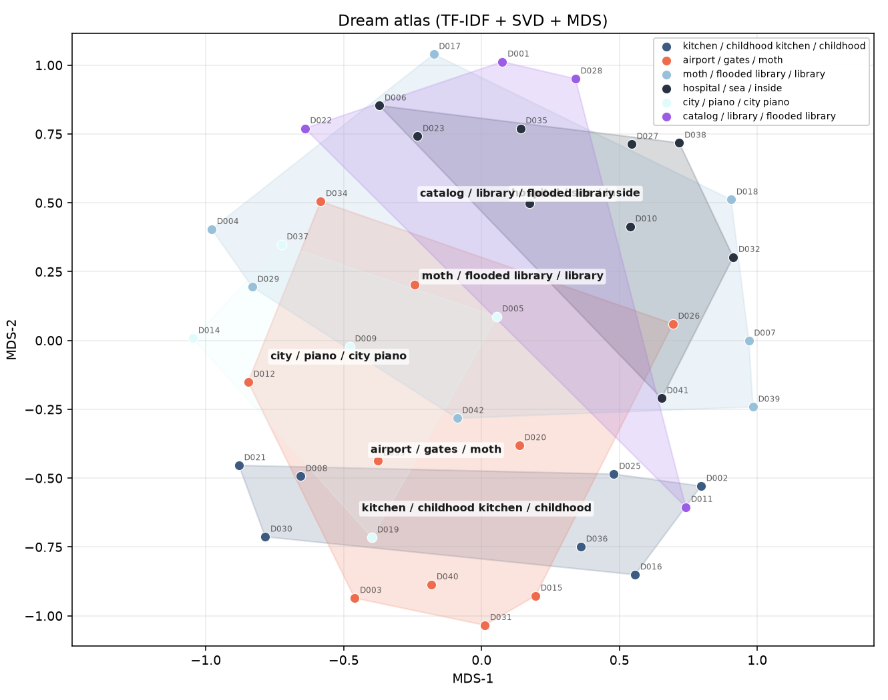
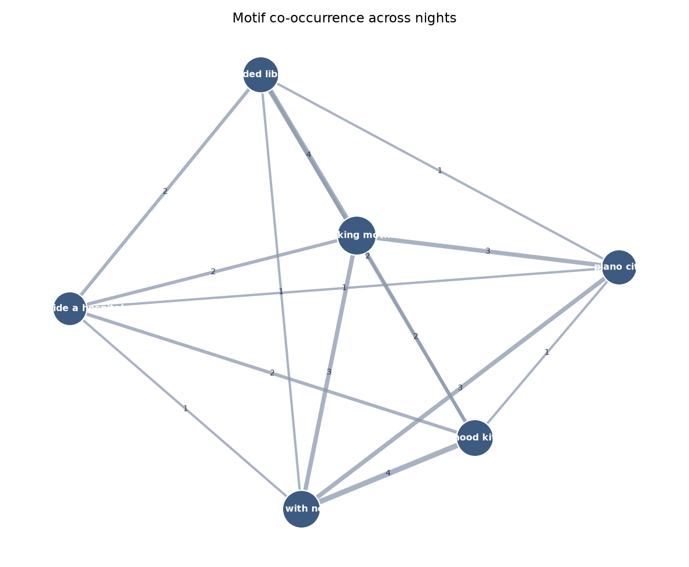

# Dream Cartographer

**In one sentence:** it reads a set of dream reports and draws a map of which nights feel similar, plus a network of images that keep coming back.

## What this does

You start with short written dreams. The code turns each night into a bag of words, places similar nights next to each other on a 2D map, and names the regions from the words that show up there (a flooded library, a kitchen, an airport with no gates, and so on).

A second figure is a **motif graph**: if two images appear in the same night, they get an edge. The bigger a node is, the more it sits at the center of the dream vocabulary.

This uses the bundled sample journal in `data/dreams.jsonl`. Swap that file if you want to try your own text.



*Each point is one night. Color = a region found by clustering. Hulls are just a visual outline of the cluster.*



*Recurring images and how often they share a night.*

## How it works

1. Turn each report into TF-IDF features (word and character n-grams).
2. Compress to 24 dimensions with SVD, then lay nights out with MDS.
3. Cluster nights and label each cluster with its top terms.
4. Detect six planted motifs with regular expressions and build a co-occurrence graph.

## How to run

```text
python -m pip install -r requirements.txt
python demo.py
python -m pytest tests/test_smoke.py -q
```

`demo.py` writes figures and CSVs under `outputs/`.

MIT License
